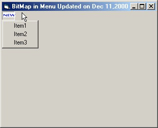



## Bitmap in Menu / SubMenu UPDATED

### Description

This code will place a bitmap file in place of your Menu or SubMenu or Both. You can put banners instead of old-fashioned menus. Please check the screenshot. Please vote if you like this code.
 
### More Info
 

             |
---                |---
**Submitted On**   |2000-12-11 08:58:04
**By**             |[Syntax](https://github.com/Planet-Source-Code/PSCIndex/blob/master/ByAuthor/syntax.md)
**Level**          |Advanced
**User Rating**    |5.0 (20 globes from 4 users)
**Compatibility**  |VB 5\.0, VB 6\.0
**Category**       |[Custom Controls/ Forms/  Menus](https://github.com/Planet-Source-Code/PSCIndex/blob/master/ByCategory/custom-controls-forms-menus__1-4.md)
**World**          |[Visual Basic](https://github.com/Planet-Source-Code/PSCIndex/blob/master/ByWorld/visual-basic.md)
**Archive File**   |[CODE\_UPLOAD1256912112000\.zip](https://github.com/Planet-Source-Code/syntax-bitmap-in-menu-submenu-updated__1-13498/archive/master.zip)

